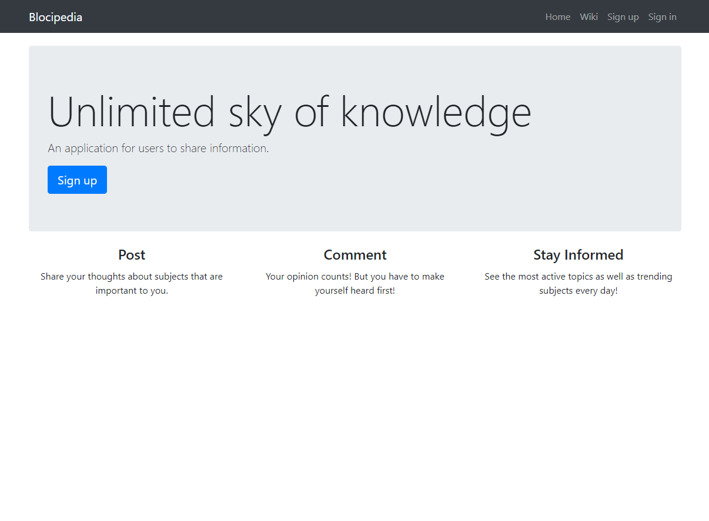

# Blocipedia

An application allows users to create, collaborate, and share (CRUD) wikis using Node.js along with Sequelize, Postgres and some middlesware to enhance application performance, such as passport, b-crypt, stripe, etc.

### Completed:

Users are able to navigate to home page, sign up, sign in and create, delete, update wikis.
Users have options to update their membership, which allows
Users are able to start, change and pause a song if possible.

### Screenshot:

## Getting Started

React installed

## Technologies & Tools

- HTML/CSS
- React

## Prerequisites

Understanding of React.js

### Installing

1. Clone the repo to your local machine \
   `$ git clone https://github.com/ngthu1995/blocipedia-node`

2. Install dependencies \
   `$ npm install`

3. Start server: \
   `$ npm start`

4. App now running on

## Built With

Node.js, Sequelize, Stripe, Bcrypt, Jasmine, Postgres

## Versioning

- @sendgrid/mail: 6.3.1
  -bcryptjs: 2.4.3
- body-parser: 1.18.2
- express: 4.16.2
- passport: 0.4.0
- pg: 7.4.1
- pg-hstore: 2.3.2
- sequelize:4.32.6
- stripe: 6.28.0

## Author

Thu Nguyen - personal website: http://thunguyen.space/

## License

This project is licensed under ThuNguyen@2019.

## Acknowledgments

A big thank to all the articles from medium and helpful guide, support from people around me.
